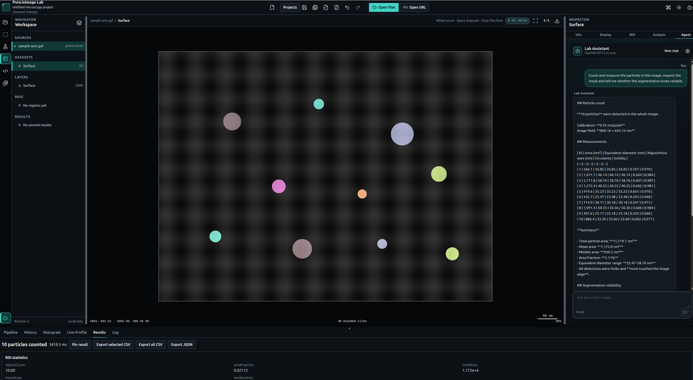

# PureJsImage Lab Viewer

This repository is the **product showcase** for [PureJsImage](https://www.npmjs.com/package/purejsimage): browser-native, local-first imaging apps. It is not the library itself.

The library (`purejsimage@0.14.0`) owns codecs, scientific rasters, GeoTIFF/COG reading, and analysis. These apps consume it only through public package exports and turn that into end-user workflows. Original files stay in the browser unless you deliberately choose a network action.

| What | Link |
| --- | --- |
| npm package | [purejsimage](https://www.npmjs.com/package/purejsimage) |
| Library site and docs | [purejsimage.com](https://purejsimage.com) |
| Library source | [github.com/a-r-d/PureJsImage](https://github.com/a-r-d/PureJsImage) |

Product changes in this repo are recorded in [`CHANGELOG.md`](CHANGELOG.md). Architecture: [`docs/adr/0001-shared-showcase-monorepo.md`](docs/adr/0001-shared-showcase-monorepo.md).

## AI-enabled particle counting



Ask the Lab Assistant to count and measure particles in plain language. The agent reads the current
calibration and analysis settings, prepares a bounded dry-run, requests approval for the scientific
operation, and executes it through the same versioned semantic actions used by the normal UI. It can
then inspect an approved, bounded viewport preview, assess the labeled detections, explain the
measurements and units, and iteratively tune the parameters when the segmentation needs work.

The screenshot above shows the generated calibrated SEM fixture with **10 detected particles**,
linked label overlays, per-particle measurements, aggregate ROI statistics, and the agent's analysis
in one workspace. Raw source pixels, credentials, Workers, and application stores are never exposed
as agent tools; sharing a bounded viewport image and running analysis remain approval-gated.

The Science app supports a configurable OpenRouter model and keeps the ordinary workbench fully
usable without an API key. See [`docs/AGENT_V2.md`](docs/AGENT_V2.md) for the agent boundary and
[`docs/SEGMENTATION_PARTICLE_ANALYSIS.md`](docs/SEGMENTATION_PARTICLE_ANALYSIS.md) for the numerical
workflow.

## Demo apps

Each app is a **separate Vite build and Cloudflare deploy**. They do not share one bundle or one imaging Worker. Medical is planned and has no application yet.

| App | Live URL | Local command | What it is |
| --- | --- | --- | --- |
| Science (Materials Workbench) | [lab.purejsimage.com](https://lab.purejsimage.com) | `pnpm dev` or `pnpm dev:science` | Electron microscopy and materials imaging: open a local file, inspect calibration, draw ROIs, filter/segment/analyze, save and replay work. |
| Geo (PureJsImage Atlas) | [geo.purejsimage.com](https://geo.purejsimage.com) | `pnpm dev:geo` | Geospatial rasters: search Kentucky From Above, open a local/remote COG, and evaluate virtual band math, band stacks, terrain, statistics, and profiles as bounded Worker tiles. See [geo raster analysis](docs/GEO_RASTER_ANALYSIS.md). |
| Gallery | local only | `pnpm dev:gallery` | Lightweight linker to the domain apps. It does not load imaging Workers. Not bound to `purejsimage.com`. |

`purejsimage.com` is the **library homepage**, published from the core-library repo (GitHub Pages), not from this monorepo.

## Get started

Requires Node.js 24 LTS (see `.nvmrc`) and pnpm 11.21.0 via Corepack.

```sh
corepack enable
corepack prepare pnpm@11.21.0 --activate
pnpm install --frozen-lockfile
```

Then start the app you want. Vite prints the local URL (usually `http://127.0.0.1:5173`; a second app uses the next free port).

```sh
pnpm dev:science    # Materials Workbench
pnpm dev:geo        # Atlas
pnpm dev:gallery    # Showcase linker
```

`pnpm dev` and `pnpm dev:workbench` are aliases for `pnpm dev:science`. Do not put secrets in `VITE_` variables.

Useful while you work:

```sh
pnpm lint           # biome check + architecture/security (this is what CI runs after format)
pnpm format:check   # formatting only — not a substitute for pnpm lint
pnpm test           # Vitest
pnpm check          # full merge gate (format, lint, types, tests, build, e2e, deploy dry-run)
```

## Commands

| Command | Purpose |
| --- | --- |
| `pnpm dev` / `pnpm dev:science` | Run the science Vite development server |
| `pnpm dev:workbench` | Compatibility alias for `pnpm dev:science` |
| `pnpm dev:gallery` | Run the gallery linker |
| `pnpm dev:geo` | Run PureJsImage Atlas |
| `pnpm build` | Build every package and app, then enforce bundle budgets |
| `pnpm build:science` / `build:gallery` / `build:geo` | Build one application |
| `pnpm test:science` / `test:gallery` / `test:geo` | Run that app's Vitest project |
| `pnpm check` | Run the deterministic normal-CI merge gate |
| `pnpm typecheck` | Type-check every workspace project |
| `pnpm lint` | Run `biome check`, architecture boundaries, and static security checks. This is not `format:check`. |
| `pnpm format` | Format the repository with Biome |
| `pnpm format:check` | Check formatting without writing |
| `pnpm test` | Run all Vitest projects |
| `pnpm test:watch` | Run Vitest in watch mode |
| `pnpm test:e2e` | Run all Playwright science and geo browser projects |
| `pnpm test:e2e:science` | Run the science Playwright suite |
| `pnpm test:e2e:geo` | Run the geo Atlas Playwright suite |
| `pnpm test:a11y` | Run accessibility-tagged Chromium checks |
| `pnpm test:visual` | Run deterministic visual-invariant checks for science and geo |
| `pnpm test:corpus` | Validate the generated-corpus package skeleton |
| `pnpm test:performance` | Run the initial browser performance budget |
| `pnpm deploy:dry-run` | Validate science, geo, and gallery Cloudflare uploads without deploying |
| `pnpm clean` | Remove generated workspace output |

## Repository map

```text
apps/gallery               Lightweight linker (Science, Geo, planned Medical)
apps/science               Materials workbench → lab.purejsimage.com
apps/geo                   PureJsImage Atlas → geo.purejsimage.com
apps-e2e/science           Playwright product tests for the science app
apps-e2e/geo               Playwright tests for Atlas catalog, remote COG, and X-ray
packages/domain-science    Science catalogs, workflows, actions, and panels
packages/domain-geo        Geo domain model, CRS helpers, STAC client, catalog registry, Atlas copy
packages/workbench-core    Headless shared runtime and profile types
packages/workbench-react   Shared React workbench shell
packages/contracts         JSON-safe cross-runtime contracts
packages/workspace         Immutable semantic workspace foundations
packages/imaging           Sole PureJsImage runtime integration boundary
packages/viewport          Framework-neutral camera/render contracts
packages/agent             Agent policy and deterministic tool-host foundations
packages/plugin-sdk        Declarative plugin and recipe contracts
packages/ui                Generic accessible React UI primitives
packages/test-corpus       Scientific corpus manifest foundations
packages/materials-analysis  Trusted science/materials algorithm package
tooling/typescript         Shared strict TypeScript configuration
tooling/vitest             Shared unit-test configuration
tooling/playwright         Shared browser-test documentation
tooling/scripts            Boundary, security, and bundle-budget checks
services                   Documented future backend boundary only
```

## Package boundaries

Applications compose packages; packages never import applications. `packages/imaging` is
the only package allowed to import the PureJsImage runtime. Packages expose only their root
entry point, and direct `src` deep imports are rejected by the architecture check. Contracts,
workspace, agent, and plugin core remain framework and DOM independent.

See [`docs/ARCHITECTURE.md`](docs/ARCHITECTURE.md) for the complete dependency and runtime
model.

## Hosts and Cloudflare deploy

| Host | What | This repo? |
| --- | --- | --- |
| [purejsimage.com](https://purejsimage.com) | PureJsImage library site | No. GitHub Pages from [a-r-d/PureJsImage](https://github.com/a-r-d/PureJsImage). |
| [lab.purejsimage.com](https://lab.purejsimage.com) | Science workbench | Yes. Worker `purejsimage-materials-workbench`. |
| [geo.purejsimage.com](https://geo.purejsimage.com) | Geo Atlas | Yes. Worker `purejsimage-geo`. |

Gallery is separately built (`@pji-workbench/gallery`) and is **not** bound to apex
`purejsimage.com`.

```sh
pnpm --filter @pji-workbench/science exec wrangler deploy   # lab.purejsimage.com
pnpm --filter @pji-workbench/geo exec wrangler deploy       # geo.purejsimage.com
pnpm deploy:dry-run                                         # all apps, no remote resources
```

Each app has its own `wrangler.jsonc`.

## Testing philosophy

Tests begin at public package boundaries, use deterministic local fixtures, and add browser,
corpus, accessibility, visual, security, and performance coverage as behavior is implemented.
No normal test uses a live API key, live model, or uncontrolled external dataset. Checks never
regenerate scientific or visual goldens automatically.

## Backend status

Backend services are not implemented. Local file viewing, analysis, projects, and future BYOK
agent use must remain complete browser-local workflows. [`services/README.md`](services/README.md)
records the optional future service boundary without speculative CRUD code.
